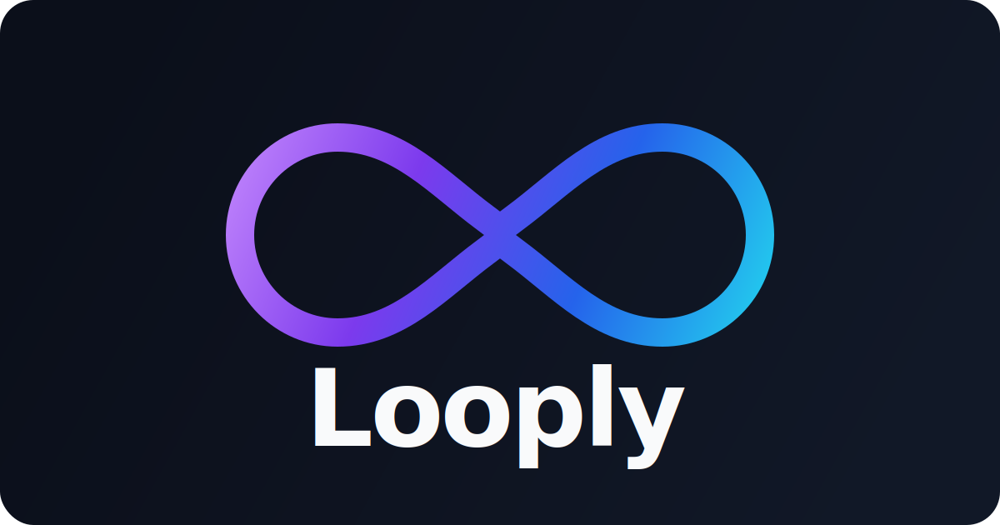

<p align="center">
  
</p>

<p align="center">
  <strong>Engineering artifacts for AI-assisted teams.</strong><br>
  From discovery to delivery — structured, host-agnostic, and versioned.
</p>

<p align="center">
  <a href="https://www.npmjs.com/package/@looply-cli/looply"></a>
  <a href="https://www.npmjs.com/package/@looply-cli/looply"></a>
  <a href="https://github.com/riguelbf/looply/actions/workflows/publish-npm.yml"></a>
  <a href="https://github.com/riguelbf/looply/actions/workflows/docs-pages.yml"></a>
  <a href="./LICENSE"></a>
  <a href="#quick-start"></a>
</p>

---

## Recent Updates

- **Knowledge Graph** — persistent knowledge graph connecting modules, classes, functions and database tables. Resolves cross-module dependencies, extracts schema from Prisma/Drizzle/TypeORM/SQL migrations (zero connection), and uses graph traversal to map features to impacted entities. Run `looply refresh-code-context`.
- **Update notifier** — checks for newer `@looply-cli/looply` versions on npm on every command and suggests `npm install -g` to upgrade. 24h cache, never blocks execution.
- **DB schema extraction (Layer 1)** — extracts tables, columns and foreign keys from `prisma/schema.prisma`, Drizzle, TypeORM decorators and SQL migrations. Static, no connection, no credentials.
- **Cross-module dependency resolver** — `dependsOnModules` now populated with real module dependencies by resolving relative imports across TypeScript, JavaScript, Python and .NET.
- **Install flow + story-to-production skill** — installation prompts to generate code intelligence on completion. `story-to-production` skill now references the knowledge graph in execution rules.

---

> 📌 **Current status**: see [PROJECT_STATUS.md](./PROJECT_STATUS.md) for the up-to-date product snapshot, in-progress work, and next steps.

## Why Looply

AI coding agents are powerful but inconsistent. Without structure, every session starts from scratch — different tone, different conventions, different quality bar.

Looply solves this by shipping a curated, versioned set of **packs** — Markdown artifacts that encode your team's workflows, standards, agents, and operational context. Agents read them before producing output, so every session is calibrated the same way.

## How It Works

1. **Install** a pack into your project: `looply install`
2. **Publish** the pack to your AI hosts (Codex, Claude Code)
3. **Work** through structured workflows (`idea-to-prd` → `prd-to-stories` → `story-to-production`)
4. **Intervene** when needed (`replay`, `run-task`, `run-agent`, `reconcile`)
5. **Repeat** — packs are versioned, shared, and improved over time

## Quick Start

```bash
npm install -g @looply-cli/looply
cd your-project
looply install
```

Or try without installing:

```bash
npx @looply-cli/looply --help
```

## Features

| Area | Description |
|---|---|
| **Packs** | `engineering-base`, `product-base`, `software-delivery-suite` — modular, composable via `includes` |
| **Multi-host** | Publishes the same artifact set to Codex, Claude Code, and the local desktop companion |
| **Workflows** | `idea-to-prd`, `prd-to-stories`, `story-to-production`, `cloud-workload-design`, `platform-foundation-evolution` — handoff between agents |
| **Interventions** | `replay`, `run-task`, `run-agent`, `reconcile` — deviate from a workflow without losing state |
| **Project rules** | Six categories (`coding-standards`, `testing-requirements`, `security-policies`, etc.) — standard defaults or custom |
| **ICL guidance** | In-context example layer that calibrates agent output style and quality |
| **Code intelligence** | Multi-language code-context discovery + Knowledge Graph with module dependency resolution and database schema extraction |
| **Autocomplete** | Bash, Zsh, PowerShell — generated from the real CLI tree |
| **Desktop companion** | Local Electron app for browsing project snapshots, features, and sessions |
| **Docs** | Built-in VitePress portal — `looply docs open` or automated GitHub Pages deploy |

## Usage

```bash
# Interactive install with guided questionnaire
looply install

# Explicit parameters (non-interactive)
looply install \
  --host codex,claude \
  --scope project \
  --pack all \
  --locale pt-BR \
  --project-mode existing-project \
  --interaction-mode balanced

# Check project status
looply status
looply status --json

# Start a workflow
looply autonomy minha-feature

# Intervene during a workflow
looply replay minha-feature --from tech-spec
looply run-task minha-feature review-code
looply reconcile minha-feature

# Validate and diagnose
looply validate
looply doctor --host codex,claude --scope project

# Manage ICL guidance
looply icl set reduced

# Open documentation
looply docs open
```

## Commands

| Command | Description |
|---|---|
| `install` | Install packs and publish to hosts |
| `uninstall` | Remove looply from the project |
| `reinstall` | Reinstall while preserving customizations |
| `validate` | Validate artifacts and contracts |
| `doctor` | Installation diagnostics per host/scope |
| `status` | Consolidated project snapshot |
| `sync` | Sync published state with source |
| `refresh-context` | Update project context and code-context |
| `refresh-code-context` | Refresh code-context snapshot and knowledge graph (`--skip-graph` to skip graph) |
| `check-updates` | Check for newer pack versions |
| `upgrade` | Upgrade packs |
| `autonomy` | Derive the next host-driven cycle for a feature |
| `replay` | Resume a workflow from a previous artifact |
| `run-task` | Record a manual task execution |
| `run-agent` | Record a manual agent intervention |
| `reconcile` | Reconcile a feature after interventions |
| `list` | List available workflows, agents, or tasks |
| `inspect` | Show details of a workflow or agent |
| `integrations` | Expose known integration contexts |
| `icl` | Manage ICL example guidance |
| `docs` | Generate, build, and serve documentation |
| `completion` | Generate and install shell autocomplete |

## Workflows

| Workflow | Purpose |
|---|---|
| `idea-to-prd` | Transform an idea into a PRD with context and constraints |
| `prd-to-stories` | Break a PRD into implementable stories |
| `story-to-production` | Take a story from tech design through review to release |
| `workflow-status` | Inspect state and recommend the next step |
| `cloud-workload-design` | Cloud topology, async-first, queueing, and governance decisions |
| `platform-foundation-evolution` | Shared foundation, guardrails, pipelines, identity, and observability |

## Approach

**Artifact-first.** Every workflow stage produces a versioned Markdown artifact. Nothing lives only in chat history.

**Task-first.** Workflows are composed of discrete tasks, each owned by a named agent with explicit input/output contracts.

**Host-agnostic core.** The artifact engine doesn't know about any specific AI host. Publishing is a separate, host-aware layer.

**Codebase-first.** In existing projects, the real repository is always the primary source of truth. Looply context files are accelerators — not replacements.

**Incremental sync.** Updates are applied by file ownership. User customizations in `.looply/custom/` are never overwritten.

**Progressive disclosure.** Packs include checklists, templates, and decision trees that grow with the team — without requiring everyone to know everything upfront.

## Documentation

Full documentation at [riguelbf.github.io/looply](https://riguelbf.github.io/looply).

## Contributing

Looply is an opinionated tool. Contributions are welcome in the form of issues and pull requests. When proposing changes, start with the rationale — what problem it solves and why the current design falls short.

## License

[Apache 2.0](./LICENSE)
