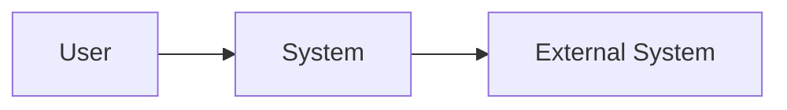
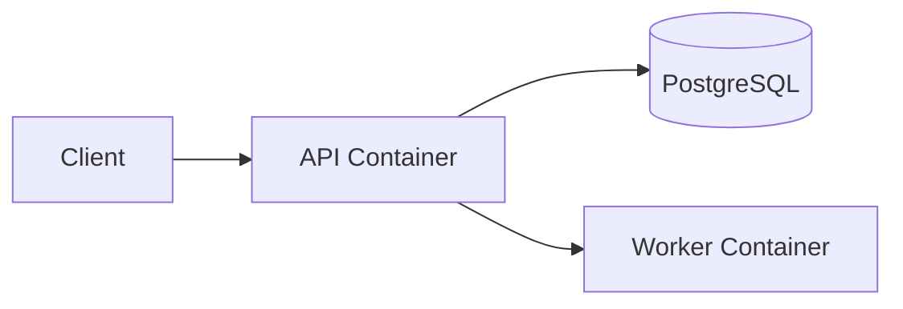
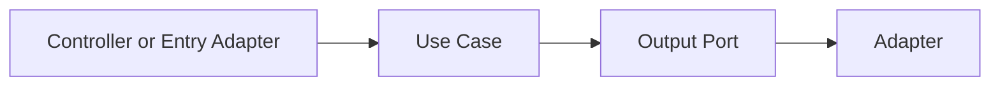
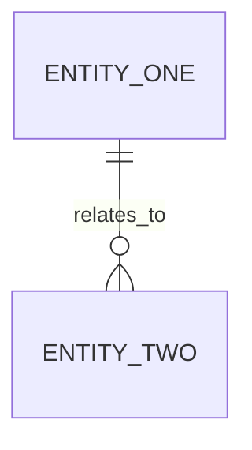
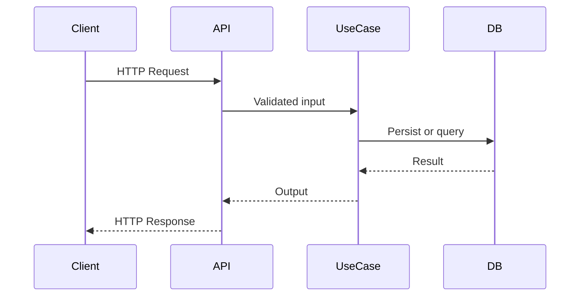

# tech-spec-template

Template for technical specification

## Metadados

- summary: `Template for technical specification`

## Conteudo do artefato

# Tech Spec

## Context

## Goal

## Project Baseline

## Delivery Mode

## Scope

## Out Of Scope

## Current Architecture Understanding

## Recommended Stack

## Requirements Mapping

## Architecture

Preferir C4 para contexto, containers e componentes quando esses niveis ajudarem a explicar a solucao.

## Architecture Diagrams

### C4 Context

### C4 Container

### C4 Component

## Components

## Data And Contracts

## Communication Strategy

Explicitar quando o fluxo sera sincronico, assincrono ou hibrido. No baseline avancado, justificar uso de filas, eventos, retries, idempotencia e consistencia eventual quando aplicavel.

## Data Model Diagram

Usar Mermaid para entidades, agregados, relacionamentos e fronteiras de persistencia relevantes.

## Authentication Strategy

## Documentation Strategy

## Request Or Service Flow Diagram

Usar Mermaid para mostrar o request principal ou a comunicacao entre servicos, incluindo validacao, caso de uso, persistencia e integracoes.

## Operational Considerations

## Risks

## Decisions

## Implementation Plan

## Testing Strategy

## Rollout Notes

## Completion Table

| Item | Status | Notes |
| --- | --- | --- |
| Architecture baseline | Done |  |
| Data model | Pending |  |
| Request or service flow | Pending |  |

## Arquivo

- `packs/engineering-base/templates/tech-spec-template.md`

[Voltar para templates](../templates)
