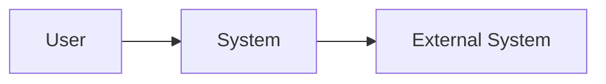
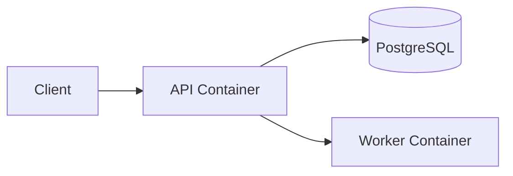
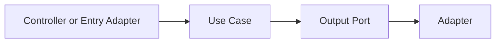
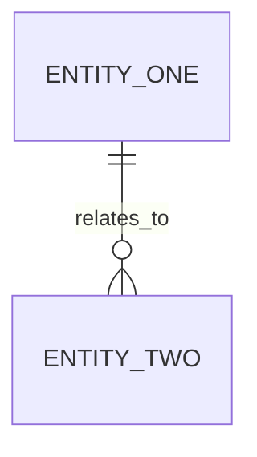
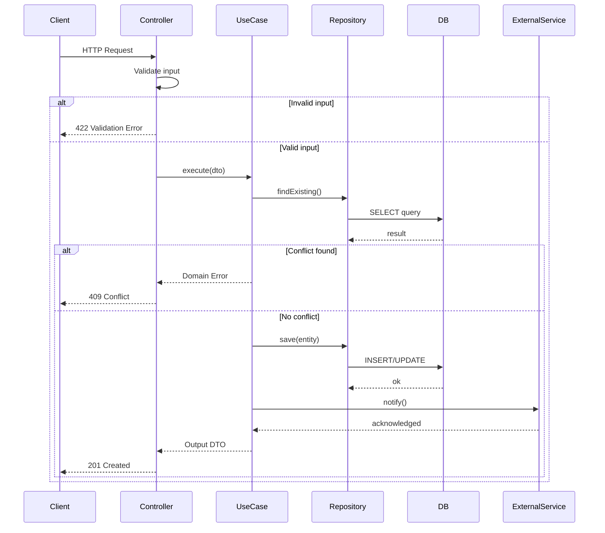
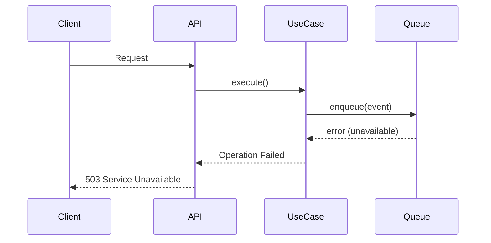
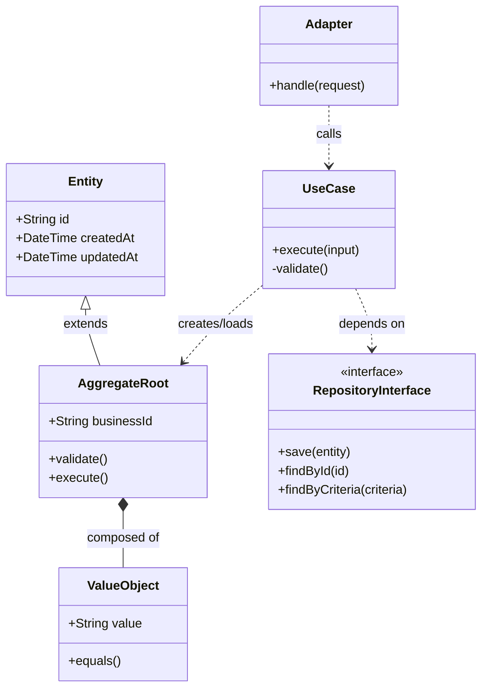

# Tech Spec

## Context

## Goal

## Project Baseline

## Delivery Mode

## Scope

## Out Of Scope

## Current Architecture Understanding

## Recommended Stack

## Requirements Mapping

## Architecture

Preferir C4 para contexto, containers e componentes quando esses niveis ajudarem a explicar a solucao.

## Architecture Diagrams

### C4 Context



### C4 Container



### C4 Component



## Components

## Data And Contracts

## Communication Strategy

Explicitar quando o fluxo sera sincronico, assincrono ou hibrido. No baseline avancado, justificar uso de filas, eventos, retries, idempotencia e consistencia eventual quando aplicavel.

## Data Model Diagram

Usar Mermaid para entidades, agregados, relacionamentos e fronteiras de persistencia relevantes.



## Authentication Strategy

## Documentation Strategy

## Sequence Diagrams

Diagramas de sequencia OBRIGATORIOS para cada fluxo principal. Devem mostrar participantes, mensagens, condicoes de erro e rollback.

### Fluxo Principal (ex: criacao de recurso)



### Fluxos Alternativos

Descrever e diagramar cada fluxo alternativo (erro, fallback, retry, compensacao).

### Fluxo de Erro e Rollback



## Class And Object Relationship Diagram

Diagrama OBRIGATORIO mostrando classes, objetos, agregados e seus relacionamentos para o escopo da story. Usar Mermaid classDiagram.



## File Tree

Arvore de arquivos a serem CRIADOS, MODIFICADOS e REMOVIDOS neste ciclo de implementacao.

```
src/
  modules/<feature>/
    controllers/
      <name>.controller.ts        [CREATE]
      <name>.controller.spec.ts   [CREATE]
    use-cases/
      <name>.use-case.ts          [CREATE]
      <name>.use-case.spec.ts     [CREATE]
    domain/
      entities/
        <name>.entity.ts          [CREATE]
      value-objects/
        <name>.vo.ts              [CREATE]
      repositories/
        <name>.repository.interface.ts  [CREATE]
    infra/
      repositories/
        <name>.repository.impl.ts [CREATE]
      adapters/
        <name>.adapter.ts         [CREATE]
    <name>.module.ts              [MODIFY] - registrar novo controller e providers

  tests/
    integration/
      <name>.integration.spec.ts  [CREATE]

db/
  migrations/
    <timestamp>-<description>.sql [CREATE]
```

### Legenda

| Simbolo | Significado |
|---|---|
| [CREATE] | Arquivo novo a ser criado |
| [MODIFY] | Arquivo existente a ser alterado |
| [DELETE] | Arquivo a ser removido |

## Operational Considerations

## Risks

## Decisions

## Implementation Plan

## Testing Strategy

## Rollout Notes

## Completion Table

| Item | Status | Notes |
| --- | --- | --- |
| Architecture baseline | Done |  |
| Data model | Pending |  |
| Sequence diagrams | Pending |  |
| Class/object relationships | Pending |  |
| File tree | Pending |  |
| Request or service flow | Pending |  |
